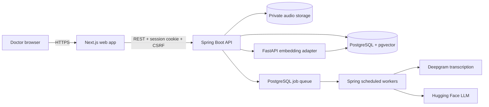

# ScribeMedAI

ScribeMedAI is a Romanian-first medical documentation MVP that helps doctors turn a consultation recording into a structured clinical-note draft. The system supports patient and consultation management, asynchronous transcription, AI-assisted SOAP note generation, doctor review, explicit approval, document history, a medication catalog, and a tenant-scoped medical knowledge base.

AI output is always a draft. ScribeMedAI does not diagnose, prescribe, or approve clinical documentation on behalf of a doctor.

> [!WARNING]
> This repository is an MVP and is not ready for real-patient use without the privacy, security, retention, legal, and operational controls described in the [architecture baseline](docs/architecture/system-architecture.md).

## Product workflow

The target consultation workflow is:

1. The doctor signs in and selects or creates a patient.
2. The doctor creates a consultation.
3. The doctor confirms that the patient has been informed about the recording and processing flow.
4. The doctor records or uploads consultation audio.
5. The backend stores the audio privately and creates a PostgreSQL-backed processing job.
6. A worker transcribes the audio and generates a structured SOAP draft asynchronously.
7. The doctor reviews the transcript, resolves review flags, and edits the draft.
8. The doctor explicitly approves the selected document version.
9. The approved, immutable version is retained in the patient's consultation history.

The architecture is deliberately human-in-the-loop: generated content cannot transition directly to an approved state.

## Current capabilities

- Opaque, server-side authentication sessions stored in secure cookies
- CSRF protection for state-changing browser requests
- Tenant-scoped patients, consultations, documents, jobs, and knowledge resources
- Patient creation, lookup, search, and consultation history
- Consultation creation and patient-information confirmation
- Browser audio upload with local or S3-compatible private storage
- Asynchronous transcription through Deepgram
- AI-assisted SOAP note generation through a provider interface
- Versioned clinical drafts, doctor editing, explicit approval, and audit events
- Patient document history
- Romanian medication-nomenclature import and browsing
- Tenant-scoped PDF knowledge ingestion, chunking, pgvector storage, and question answering
- Request correlation, health probes, rate limiting, and sanitized API errors

PDF export of approved clinical documents, a longitudinal patient medication list, SIUI integration, billing, scheduling, and electronic prescribing are outside the current implementation.

## Architecture

ScribeMedAI uses a modular-monolith architecture. Spring Boot is the only business backend; domain and application rules remain in the backend even when the web interface or auxiliary model service is used.



### Frontend

The `frontend` application uses Next.js, React, TypeScript, and Tailwind CSS. It provides the Romanian doctor-facing interface and proxies `/api/*` requests to the Spring Boot backend. It is a presentation layer, not a second business backend.

### Backend

The `backend` application is a Spring Boot modular monolith organized by business capability:

- `identity` and `tenancy` — users, opaque sessions, authorization, and tenant context
- `patient` — tenant-owned patient records
- `consultation` — consultation lifecycle, consent confirmation, notes, and audio intake
- `transcription` — speech-to-text provider abstraction and transcript persistence
- `processing` — PostgreSQL-backed jobs, polling workers, retries, and state transitions
- `document` — SOAP drafts, immutable versions, review, approval, and history
- `medication` — Romanian medication nomenclature and import pipeline
- `knowledge` — PDF ingestion, retrieval, embeddings, and knowledge-assisted answers
- `audio` — local and S3-compatible private storage adapters
- `audit` — append-only business and security audit events
- `shared` — API errors, security, logging, JSON support, and rate limiting

Controllers handle HTTP concerns only. Transactions and business rules live in application services, while provider-specific integrations remain behind internal interfaces.

### Data and background processing

PostgreSQL is the system of record, and Flyway owns all schema changes. Medical and tenant-owned tables carry a `tenant_id`, with ownership enforced in service and repository lookups.

Long-running work is not performed in the initiating HTTP request. Scheduled workers claim rows from `processing_job`, execute transcription or document processing, and persist sanitized failure information for retry. This keeps the MVP operationally simple without introducing a message broker.

The embedding service is a stateless ML adapter for `intfloat/multilingual-e5-small`. It returns 384-dimensional vectors; authorization, document access, retrieval rules, and answer generation remain in Spring Boot. Embeddings are stored in PostgreSQL through pgvector rather than a separate vector database.

### Clinical document lifecycle

```text
AI_GENERATED draft
        │
        ▼
Doctor review and edits
        │
        ├── creates new immutable versions
        ▼
Explicit doctor approval
        │
        ▼
APPROVED version (immutable)
```

Provider, model, prompt version, template version, source, author, and timestamps are retained with document versions. Corrections after approval must create a new version; approved content is never overwritten.

## Security and privacy model

The MVP is designed around the following constraints:

- Opaque session identifiers are stored in `HttpOnly` cookies and only their hashes are persisted.
- Browser mutations require CSRF protection.
- Frontend route guards improve usability but are not treated as a security boundary.
- Tenant ownership is checked at both the HTTP and service/repository layers.
- Audio storage is private, and object keys must not contain patient identifiers.
- AI output remains a draft until an authenticated, authorized doctor approves it.
- Audit events are append-only from the application's perspective.
- Medical content, patient names, prompts, audio, credentials, cookies, and session tokens must not be written to operational logs.
- External-provider errors are sanitized before they are stored or returned.

Before any real-patient pilot, complete the DPIA, retention policy, data-processing agreements, incident-response plan, backup restoration test, and automated tenant-isolation testing.

## Technology stack

| Area | Technology |
| --- | --- |
| Web application | Next.js 16, React 19, TypeScript, Tailwind CSS 4 |
| Business backend | Java 25, Spring Boot 4.1, Spring Security, Spring Data JPA |
| Database | PostgreSQL 18 with pgvector |
| Migrations | Flyway |
| Audio storage | Local development storage or S3-compatible private object storage |
| Transcription | Deepgram through an internal provider boundary |
| Note and knowledge generation | Hugging Face-compatible chat-completions API |
| Embeddings | FastAPI, Sentence Transformers, multilingual E5 |
| Backend testing | JUnit, Spring test support, Testcontainers |

## Repository structure

```text
ScribeMedAI/
├── backend/                 Spring Boot API, workers, domain modules, and migrations
├── frontend/                Next.js doctor-facing application
├── embedding-service/       Stateless multilingual embedding adapter
├── infrastructure/          Deployment and infrastructure assets
├── docs/
│   └── architecture/
│       └── system-architecture.md
├── AGENTS.md                Repository-specific engineering rules
└── README.md
```

## Local development

### Prerequisites

- Docker with Docker Compose
- Java 25
- Node.js 20 or newer
- pnpm
- Python 3.11 or newer for the embedding service
- Deepgram and Hugging Face credentials for real transcription and generation

### 1. Start PostgreSQL

Create `backend/.env` with local-only values:

```dotenv
POSTGRES_DB=scribemed
POSTGRES_USER=scribemed
POSTGRES_PASSWORD=choose-a-local-password
```

Then start the database:

```bash
cd backend
docker compose up -d postgres
```

The database is exposed at `localhost:5432`. Flyway migrations run when the backend starts.

### 2. Start the embedding service

The embedding model is downloaded on first startup, so the initial launch can take longer.

```bash
cd embedding-service
python3 -m venv .venv
source .venv/bin/activate
pip install -r requirements.txt
uvicorn app.main:app --reload --port 8000
```

Health endpoint: `http://localhost:8000/health`

### 3. Start the backend

From a new terminal:

```bash
cd backend

export DATABASE_URL=jdbc:postgresql://localhost:5432/scribemed
export DATABASE_USERNAME=scribemed
export DATABASE_PASSWORD=choose-a-local-password
export SPRING_DOCKER_COMPOSE_ENABLED=false
export SCRIBEMED_SESSION_COOKIE_SECURE=false

./mvnw spring-boot:run
```

The API starts at `http://localhost:8080`; its health endpoint is `http://localhost:8080/actuator/health`.

To exercise transcription and AI generation, also provide:

```bash
export DEEPGRAM_API_KEY=your-key
export HF_TOKEN=your-token
```

For an isolated development account, enable the opt-in seed before starting the backend:

```bash
export SCRIBEMED_DEV_SEED_ENABLED=true
export SCRIBEMED_DEV_TENANT_NAME="Cabinet demonstrativ"
export SCRIBEMED_DEV_DOCTOR_EMAIL="doctor@example.test"
export SCRIBEMED_DEV_DOCTOR_PASSWORD="choose-a-development-password"
export SCRIBEMED_DEV_DOCTOR_DISPLAY_NAME="Dr. Demo"
```

Never enable development seeding or commit credentials in a production environment.

### 4. Start the frontend

From another terminal:

```bash
cd frontend
pnpm install
pnpm dev
```

Open `http://localhost:3000`. The frontend uses `http://localhost:8080` by default; override it with `SCRIBEMED_BACKEND_URL` when necessary.

## Configuration reference

| Variable | Purpose | Default |
| --- | --- | --- |
| `DATABASE_URL` | JDBC PostgreSQL connection URL | Required |
| `DATABASE_USERNAME` | PostgreSQL user | Required |
| `DATABASE_PASSWORD` | PostgreSQL password | Required |
| `SCRIBEMED_BACKEND_URL` | Backend URL used by Next.js | `http://localhost:8080` |
| `SCRIBEMED_SESSION_COOKIE_SECURE` | Require HTTPS for the session cookie | `true` |
| `SCRIBEMED_AUDIO_STORAGE_BACKEND` | Audio adapter (`local` or configured S3 backend) | `local` |
| `SCRIBEMED_AUDIO_LOCAL_STORAGE_DIR` | Local development audio directory | `./var/audio` |
| `SCRIBEMED_AUDIO_S3_BUCKET` | Private audio bucket | Empty |
| `AWS_REGION` | S3 region | Empty |
| `DEEPGRAM_API_KEY` | Transcription-provider credential | Empty |
| `HF_TOKEN` | Hugging Face provider credential | Empty |
| `EMBEDDING_SERVICE_URL` | Embedding adapter base URL | `http://localhost:8000` |
| `SCRIBEMED_PROCESSING_WORKER_ENABLED` | Enable scheduled processing workers | `true` |
| `SCRIBEMED_MEDICATION_IMPORT_ENABLED` | Enable medication-catalog import at startup | `false` |
| `SCRIBEMED_MEDICATION_IMPORT_FILE_PATH` | Source Excel nomenclature path | Development-specific fallback |

See [application.yml](backend/src/main/resources/application.yml) for the complete backend configuration surface. Production secrets must come from environment variables or a secret manager.

## Verification

Backend tests, including Testcontainers-based PostgreSQL integration tests:

```bash
cd backend
./mvnw test
```

Frontend static checks and production build:

```bash
cd frontend
pnpm lint
pnpm typecheck
pnpm build
```

Docker must be available for Testcontainers integration tests. Provider credentials are not required for tests that use mocked provider boundaries.

## Engineering principles

- Keep Spring Boot as the only business backend.
- Preserve the modular-monolith boundaries; do not introduce infrastructure without a demonstrated need.
- Validate input at system boundaries and keep transactions in application services.
- Make background work idempotent and safe to retry.
- Never overwrite approved documents or previous versions.
- Treat all AI-generated clinical content as untrusted draft data.
- Keep product-facing copy in Romanian and technical identifiers in English.
- Add tenant-isolation, authorization, state-transition, and provider-contract tests for sensitive changes.
- Update the architecture document when an approved system-level decision changes.

## Scope and limitations

ScribeMedAI is a documentation assistant, not a complete EHR. The MVP does not provide automated diagnosis, treatment recommendations, electronic prescriptions, SIUI integration, billing, appointment scheduling, or autonomous clinical decisions.

The authoritative design constraints and rollout requirements live in [docs/architecture/system-architecture.md](docs/architecture/system-architecture.md).
